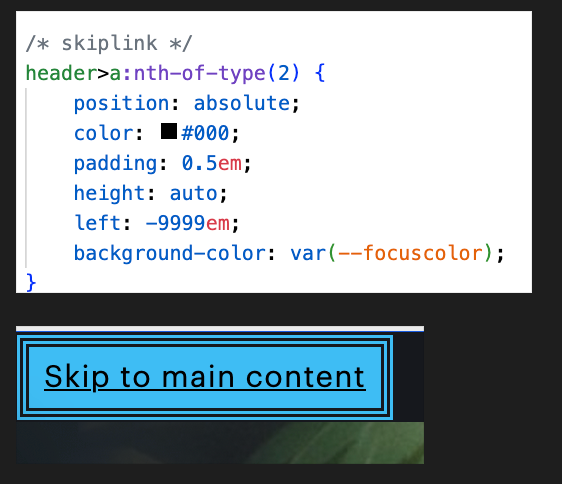
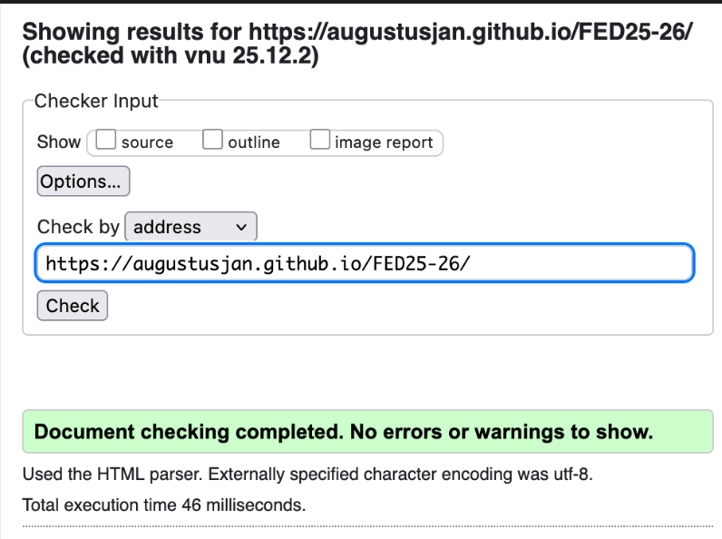
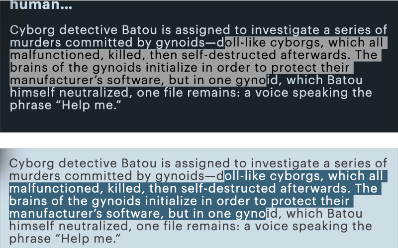
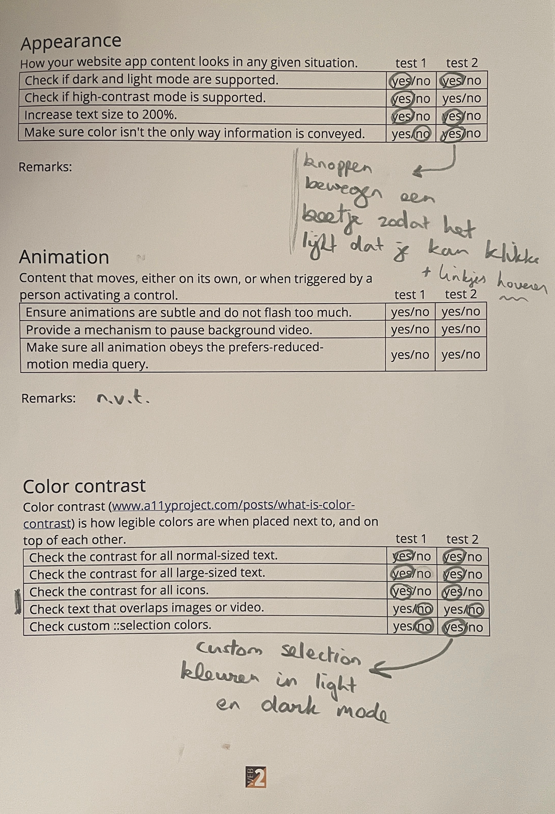
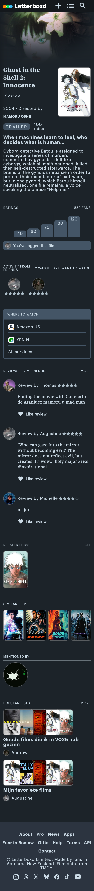

# Procesverslag
Markdown is een simpele manier om HTML te schrijven.  
Markdown cheat cheet: [Hulp bij het schrijven van Markdown](https://github.com/adam-p/markdown-here/wiki/Markdown-Cheatsheet).

Nb. De standaardstructuur en de spartaanse opmaak van de README.md zijn helemaal prima. Het gaat om de inhoud van je procesverslag. Besteedt de tijd voor pracht en praal aan je website.

Nb. Door *open* toe te voegen aan een *details* element kun je deze standaard open zetten. Fijn om dat steeds voor de relevante stuk(ken) te doen.

## Jij

  ### Auteur:
  August Bruil

  #### Je startniveau:
  Blauw of rood

  #### Je focus:
  Responsive
 

## Je website

  
uitwerken voor kick-off werkgroep

  ### Je opdracht:
  De website heet Letterboxd, hier kan je films noteren die je hebt gekeken. https://letterboxd.com/

  #### Screenshot(s) van de eerste pagina (small screen): 
  Letterboxd film descriptie pagina
  

    
screenshot van homepagina

      
  

  #### Screenshot(s) van de tweede pagina (small screen):
  Letterboxd profiel
  

    
screenshot van filmpagina

     
  

 

## Toegankelijkheidstest 1/2 (week 1)

  
uitwerken na test in 2e werkgroep

  ### Bevindingen
  Lijst met je bevindingen die in de test naar voren kwamen:
  - 2 H1 op elke pagina, het logo is een H1 en de eerste tekst in de main.
  - Letterboxd is niet zo gebruikersvriendelijk voor mensen met een screenreader. Geen fijne namen voor linkjes, je zou niet weten waar de link naar toegaat. 
  - Er mist een focus styling op alles, dit moet verbeterd worden.
  - Geen skiplinks, dat zou wel handig zijn voor bepaalde dingen zoals linkjes van alle acteuren.
  - Je kan inzoomen en lettertype kon ook groter worden, het word niet geblokkerd.
  

  
  

  - Contrast van het website is wel oke, de leesbare tekst voldoet, maar kleine dingen zoals datum bij een film gekeken is dan weer te donker.
  

  
  

  De website kan veel dingen verbeteren om het toegankelijker te maken voor iedereen.

## Breakdownschets (week 1)

  
uitwerken na afloop 3e werkgroep

  ### de hele homepagina: 
  

  ### de hele filmpagina: 
  

## Voortgang 1 (week 2)

  
uitwerken voor 1e voortgang

  ### Stand van zaken
  - Snap niet hoe ik sommige stukken moet namaken, bijvoorbeeld de cast informatie tabs. Moet nog inkomen met meeste dingen van code schrijven. 
  - Gebruik ik de goeie css selectors?
  - Niet zeker wanneer flex of grid beter is bij bepaalde stukken. Nu grid gebruikt.
  - Filmposters in een unordered list gedaan, zou dit een article of iets anders moet zijn?

  ### Agenda voor meeting
  samen met je groepje opstellen

  | August           | Kevin            | Senuk    | student 4        |
  | ---                         | ---                         | ---                 | ---              |
  | Hoe maak je een grafiek,    | Hoe maak je een svg         | Hoe maak je forms   | en dan ik dat    |
  | mag ik ook foto gebruiken?  |  die alleen in de html zit, | en een carousel     | dit wil ik zeker |
  | Grid of flexbox?            |  naar een bestand           | ...                 | ...              |

  ### Verslag van meeting
  hier na afloop snel de uitkomsten van de meeting vastleggen

  - Hoe ik de ratings kan maken in css met de meter tag en hoe ik dan een background image kan toevoegen voor de sterren.
  - Html fixxen, nog toegankelijker maken. Dan pas CSS toepassen.
  - Header 3 knoppen maken, nav maken.
  - Over svg's gehad.
  - 3 Stylesheet maken.

## Voortgang 2 (week 3)

  
uitwerken voor 2e voortgang

  ### Stand van zaken
  hier dit ging goed & dit was lastig (neem ook screenshots op van delen van je website en code)
  - In meeste sections is er een h2 en een a, snap niet hoe ik die naast elkaar moet zetten.
  - Met een @media query kleuren van de meter bar veranderd in light en dark mode, of het op deze manier mag, omdat fill niet werkt op url's.
  - Had moeite met de header goed te krijgen, moet nog goed doorwerken met de rest.
  - De h3 met filmnamen nu gehide door naar de zijkant te doen, hoe moet ik dit anders doen? 
  - Begrijp niet hoe ik in mijn header nav lijntjes moet maken als decoration dat laat zien dat het seperated is.
  - Moeite gehad met het maken van een light mode, omdat de standaard al een dark mode is. Mijn light versie was niet meer in de stijl van Letterboxd.

  ### Agenda voor meeting
  samen met je groepje opstellen

  | August                                 | Senuk              | Kevin       | student 4        |
  | ---                                    | ---                | ---              | ---              |
  | Hoe maak ik mijn h2 en a naast elkaar? | Hamburger Menu     | en ik dit        | en dan ik dat    |
  | Is mijn media query voor meter oke?    | Pop-Up voor text   | nog een punt     | dit wil ik zeker |
  | Hoe hide ik mijn h3's?                 | ...                | ...              | ...              |

  ### Verslag van meeting
  hier na afloop snel de uitkomsten van de meeting vastleggen

  - Grid-row toegevoegd op de sections om h2 en de a naast elkaar te maken, met span kon ik de ul over 2 rijen zetten.
  - Om de h3's te hiden een visually hidden class toegevoegd, dit ook toegevoegd aan andere plekken.
  - States toevoegen.

## Toegankelijkheidstest 2/2 (week 4)

  
uitwerken na test in 9e werkgroep

  ### Bevindingen
  Lijst met je bevindingen die in de test naar voren kwamen (geef ook aan wat er verbeterd is):
  Er zijn meerdere verbeteringen vergeleken met de eerst test. 
  Heb meerdere dingen toegevoegd zoals betere responsiveness, skiplink om naar de main content te gaan. Focus states toegevoegd, die waren er niet. Er waren geen duidelijke H1's op de pagina's en soms zelfs 2 H1's op 1 pagina. Een visually hidden class toegevoegd om dingen die alleen voor de screenreader bedoelt zijn te verbergen voor geen screenreaders. 

  De skip link code en hoe het eruit ziet op de website. 

  

  De link van github pages gevalidate. Geen errors, etc.

  

  Custom selection colors van dark en light mode.

 

  De WCAG Checklist in volledig met aantekeningen.
  
  
  

## Voortgang 3 (week 4)

  
uitwerken voor 3e voortgang

  ### Stand van zaken
  hier dit ging goed & dit was lastig (neem ook screenshots op van delen van je website en code)
  - Zijn mijn states duidelijk?
  - Moeite gehad met het maken van een grid, eindelijk gelukt.
  - Een skiplink toegevoegd en als je tabt door de site dat de dropdowns open gaan.
  - Sommige plekken een aria-label en sommige plek een visually hidden class.
  - Een light-mode toegevoegd en de contrast bij de dark-mode verbeterd.

  ### Agenda voor meeting
  samen met je groepje opstellen

   | August                                                                         | Senuk | Kevin | student 4        |
  | ---                                                                             | ---   | ---   | ---              |
  | Moet ik bij mijn header buttons de aria-label vervangen met .visually-hidden.   | ...   | ...   | en dan ik dat    |
  | Plek van de skiplink oke?                                                       | ...   | ...   | dit wil ik zeker |
  | Duidelijke states?                                                              | ...   | ...   | ...              |

  ### Verslag van meeting
  hier na afloop snel de uitkomsten van de meeting vastleggen

  - Aria label van de button verwijderd en de svg's van de buttons een title gegeven. 
  - De skiplink plek was oke, alleen de opmaak was niet zo duidelijk. Achtergrond kleur veranderd van de skiplink zodat het niet dezelfde is als de header.
  - De states nog duidelijker maken, filmposters andere focus styling. Bijvoorbeeld outline-offset gebruiken etc.
  - Axe linter errors mocht ik ignoren die ik van de button krijg.

## Eindgesprek (week 5)

  
uitwerken voor eindgesprek

  ### Je uitkomst - karakteristiek screenshots:

  Screenshots van volledige homepagina en filmpagina. Mobile en desktop.
  

    
Homepagina klein

    
  

  

    
Homepagina groot

     
  

  

    
Filmpagina klein

    
  

  

    
Filmpagina klein

    
  

  ### Dit ging goed/Heb ik geleerd: 
  Korte omschrijving met plaatjes

  

  ### Dit was lastig/Is niet gelukt:
  Korte omschrijving met plaatjes

  

## Bronnenlijst

  
continu bijhouden terwijl je werkt

  Nb. Wees specifiek ('css-tricks' als bron is bijv. niet specifiek genoeg). 
  Nb. ChatGpT en andere AI horen er ook bij.
  Nb. Vermeld de bronnen ook in je code.

  1. https://stackoverflow.com/questions/71281559/flexbox-directions-and-multiple-images-within 
  2. https://www.youtube.com/watch?v=qyQm8YeGMJQ
  3. https://codepen.io/shooft/pen/JjQLVeB 
  4. https://codepen.io/shooft/pen/myepoJo
  5. https://www.svgbackgrounds.com/tools/svg-to-css/
  6. https://nikitahl.github.io/svg-2-code/
  7. https://developer.mozilla.org/en-US/docs/Web/HTML/Reference/Elements/meter
  8. https://www.a11yproject.com/posts/how-to-hide-content
  9. https://www.youtube.com/watch?v=2h9CqRlHzrc
  10. https://chatgpt.com/
  11. https://youtu.be/0EEJM4S5w38
  12. https://youtu.be/A7KbTRqA-fk
  13. https://codepen.io/shooft/pen/vENrZvj
  14. https://developer.mozilla.org/en-US/docs/Web/CSS/Reference/Properties/mask-image
  15. https://www.a11yproject.com/posts/skip-nav-links/
  16.

